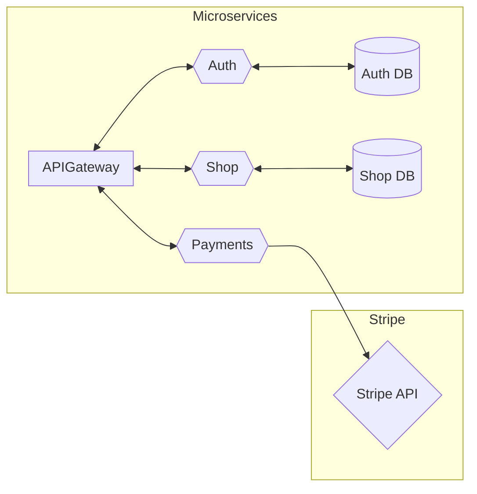

```mermaid
flowchart LR
    subgraph APIGateway
      direction LR
    end

    subgraph Microservices
      direction LR

      auth{{Auth}} <--> authDB[(Auth DB)]
      payments{{Payments}}
      shop{{Shop}} <--> shopDB[(Shop DB)]

      APIGateway <--> auth
      APIGateway <--> payments
      APIGateway <--> shop
    end

    subgraph Stripe
        direction LR

        StripeAPI{"Stripe API"}
    end

    payments --> StripeAPI
```
