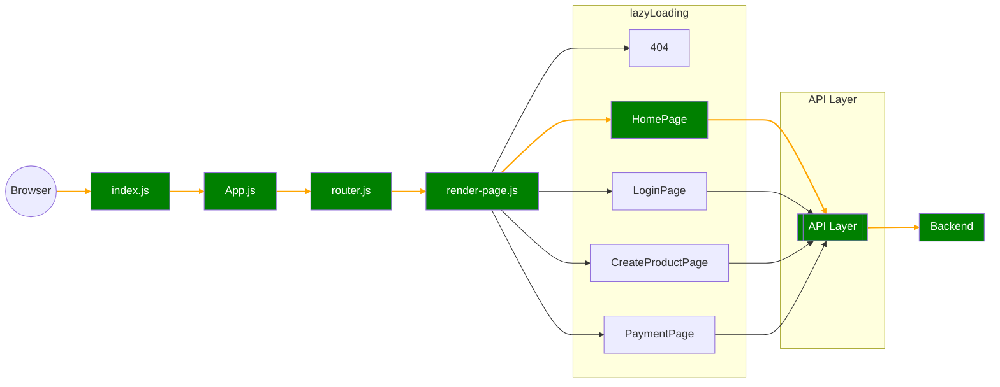

# Flow diagram

```mermaid
flowchart LR
    user((Browser)) ==> Index[index.js]

    Index ==> App[App.js]
    style Index fill:green,color:#fff


    App ==> Router[router.js]
    style App fill:green,color:#fff

    Router ==> RenderPage[render-page.js]
    style Router fill:green,color:#fff

    RenderPage ==> HomePage ==> APILayer
    style RenderPage fill:green,color:#fff

    RenderPage --> LoginPage --> APILayer
    RenderPage --> CreateProductPage --> APILayer
    RenderPage --> PaymentPage --> APILayer
    RenderPage --> 404

    subgraph lazyLoading
       direction TB

       HomePage
       style HomePage fill:green,color:#fff

       LoginPage
       CreateProductPage
       PaymentPage
       404
    end

    subgraph "API Layer"
       direction LR
       APILayer[[API Layer]]
       style APILayer fill:green,color:#fff
    end

    subgraph Backend
        style Backend fill:green,color:#fff
        direction LR
    end

    APILayer ==> Backend

    click HomePage href "https://github.com/dosandk/online-store-finished/blob/qa/src/pages/home/home-page.md" "This is a tooltip for a link"
    linkStyle 0,1,2,3,4,5,13 stroke:orange,stroke-width:2px
```
